# Context Lab 混合 IELTS 题型设计

日期：2026-07-30
状态：已完成产品确认，待书面规格审阅

## 背景

Context Lab 最初按 MVP 规格只支持选择题。后续生成器增加了
`true_false_not_given`、`matching_headings`、`summary_completion` 等
`questionType`，但题目、答案、提交和评分契约仍固定为
`options + selectedIndex + correctIndex`。

因此当前产品虽然显示多种 IELTS 题型标签，实际仍全部使用单选控件：

- True / False / Not Given 被展示为三选一。
- Summary completion 被展示为四个单词选一，不是真实文本填空。
- Matching headings 和 Matching information 被降级为单题四选一。
- 用户粘贴的填空或简答题无法按原题型保存、作答和评分。

本设计将完整阅读练习升级为真实混合题型，同时保持三分钟微练习为选择题，
并兼容已经生成和提交的历史练习。

## 已确认范围

### 纳入第一期

- 标准 Context Lab 完整阅读练习。
- 按熟练度、雅思核心词、随机 IELTS 和手输词生成的完整练习。
- 用户粘贴文章后生成的练习。
- 用户粘贴文章和自带题目后的解析练习。
- 桌面端和移动端。
- 生成、作答、提交、判分、解析、历史记录和 PDF。
- 旧练习包和旧练习记录兼容。

### 保持不变

- `micro` 三分钟薄弱词修复继续使用 3 道四选一题。
- 文章生成、目标词覆盖、计时、词汇标记与导入能力继续保留。
- 练习包和练习记录继续使用现有数据库表。

### 暂不纳入

- 真实 Matching Headings、Matching Information 和 Matching Features
  的批量匹配交互。
- 流程图、表格、图示标签等复杂版式填空。
- 拖拽作答。
- AI 语义判分。
- 跨设备未提交草稿同步。

旧练习中的 Matching Headings 和 Matching Information 继续按原选择题方式
兼容展示；新练习第一期不再生成伪匹配题。

## 产品目标

- 完整练习包含真实选择、TFNG、文本填空和简答。
- 题型名称与用户实际作答方式一致。
- 文本题使用确定性规则判分，结果可解释、可复现。
- 单题格式异常不再导致整套已生成练习失败。
- 桌面端和移动端具备相同题型能力。
- 历史记录、结果复盘和 PDF 正确表达不同答案类型。

## 非目标

- 不在本次重做 Context Lab 页面结构。
- 不更改用户词库、掌握度或复习调度规则。
- 不把 UI 调整扩展为全站样式重构。
- 不把 AI 作为提交时的最终判分来源。
- 不迁移或重写历史 JSON 数据。

## 核心概念

### `questionType`

描述题目考查的 IELTS 阅读能力或题型语义，例如：

- `detail`
- `inference`
- `paraphrase`
- `vocabulary`
- `main_idea`
- `writer_view`
- `true_false_not_given`
- `sentence_completion`
- `summary_completion`
- `short_answer`

### `responseType`

描述用户如何作答。第一期只允许：

- `single_choice`
- `true_false_not_given`
- `text_completion`
- `short_answer`

`questionType` 与 `responseType` 必须分离。例：

- `detail + single_choice`
- `summary_completion + text_completion`
- `short_answer + short_answer`
- `true_false_not_given + true_false_not_given`

### Question Group

真实 IELTS 题目按题组共享说明。每个题组包含：

- 稳定的 `groupId`
- 题型标题
- 英文作答说明
- 起止题号
- 可选 `wordLimit`
- 所属题目 ID

题组说明只展示一次，不重复塞进每道题干。

## 题目契约 V2

### 存储信封

现有 `questionsJson` 继续使用，但新练习保存为版本化对象：

```ts
type ExerciseQuestionEnvelopeV2 = {
  schemaVersion: 2;
  groups: ExerciseQuestionGroup[];
  questions: ExerciseQuestionV2WithAnswer[];
  generationWarnings?: string[];
};
```

历史 `questionsJson` 数组视为 V1。读取时转换为内存中的 V2，不回写数据库。

### 公共题目字段

```ts
type ExerciseQuestionBase = {
  id: string;
  groupId: string;
  stem: string;
  questionType: string;
  responseType:
    | "single_choice"
    | "true_false_not_given"
    | "text_completion"
    | "short_answer";
  targetWord?: string;
};
```

### 选择题

```ts
type SingleChoiceQuestion = ExerciseQuestionBase & {
  responseType: "single_choice";
  options: string[];
  correctIndex: number;
};
```

提交前的客户端响应不得包含 `correctIndex`。

### True / False / Not Given

```ts
type TfngQuestion = ExerciseQuestionBase & {
  responseType: "true_false_not_given";
  options:
    | ["True", "False", "Not Given"]
    | ["Yes", "No", "Not Given"];
  correctValue: "True" | "False" | "Yes" | "No" | "Not Given";
};
```

若题目属于作者观点，则使用 Yes / No / Not Given。同一题组只能使用其中一套
标签，`correctValue` 必须属于该题的 `options`。

### 文本填空

```ts
type TextCompletionQuestion = ExerciseQuestionBase & {
  responseType: "text_completion";
  wordLimit: 1 | 2 | 3;
  acceptedAnswers: string[];
};
```

`acceptedAnswers` 提交前不得返回客户端。答案必须能从文章原文定位，
不接受生成器编造文章中不存在的答案。

### 简答题

```ts
type ShortAnswerQuestion = ExerciseQuestionBase & {
  responseType: "short_answer";
  wordLimit: 1 | 2 | 3;
  acceptedAnswers: string[];
};
```

简答题使用文章中的词或短语作答，不在第一期支持自由论述。

## 客户端安全题目

后端返回练习详情时移除：

- `correctIndex`
- `correctValue`
- `acceptedAnswers`
- 其他能直接泄露答案的内部审计字段

客户端只接收作答所需的题干、选项、说明、限词和类型。

## 答案与提交契约

```ts
type ContextLabAnswer =
  | {
      questionId: string;
      responseType: "single_choice";
      selectedIndex: number;
    }
  | {
      questionId: string;
      responseType: "true_false_not_given";
      selectedValue: "True" | "False" | "Not Given" | "Yes" | "No";
    }
  | {
      questionId: string;
      responseType: "text_completion" | "short_answer";
      text: string;
    };
```

后端根据练习中保存的 `responseType` 校验提交字段，不能相信客户端自报类型。
每道题只允许一种答案载荷；重复 `questionId`、不匹配字段或未知题目返回
明确的 400 错误。

未作答题目可以省略。提交时前端先提示“还有 N 题未作答”，用户确认后仍可
提交；未作答题按错误计分并在结果中标记为 `unanswered`。

## 确定性文本判分

文本题不得在提交时调用 AI 判定正误。服务端按以下顺序处理：

1. 对用户答案和候选答案执行 Unicode `NFKC` 规范化。
2. 去除首尾空白。
3. 将连续空白折叠为一个空格。
4. 忽略大小写。
5. 去除答案末尾的 `. , ; : ! ?`。
6. 计算词数并校验 `wordLimit`。
7. 与 `acceptedAnswers` 中的规范化答案做精确匹配。

不会自动忽略冠词、单复数、拼写错误或改变词序。需要接受的明确变体由生成器
写入 `acceptedAnswers`。

词数按空白分隔；连字符连接的词计为一个词，纯数字或数字单位组合计为一个词。
超过限词时结果包含 `word_limit_exceeded`，不能只显示“回答错误”。

## 结果契约

```ts
type ContextLabQuestionResult = {
  questionId: string;
  responseType: ContextLabAnswer["responseType"];
  correct: boolean;
  status: "correct" | "incorrect" | "unanswered";
  userAnswer:
    | { selectedIndex: number }
    | { selectedValue: string }
    | { text: string }
    | null;
  correctAnswer:
    | { correctIndex: number }
    | { correctValue: string }
    | { acceptedAnswers: string[] };
  reasonCode?: "word_limit_exceeded" | "answer_mismatch";
  explanation: string;
  targetWord?: string;
};
```

结果复盘必须展示：

- 用户原始答案
- 正确答案
- 正确、错误或未作答
- 限词违规等确定性原因
- AI 生成的学习解析

AI 只负责解析“为什么”，不能覆盖服务端已经计算的正误。

## 生成题型组合

完整练习仍以 13 题为目标，第一期默认组合：

| 题组 | 数量 | 作答方式 |
|---|---:|---|
| Detail / Inference / Paraphrase / Vocabulary | 3 | 单选 |
| True / False / Not Given | 3 | 分类选择 |
| Sentence / Summary Completion | 4 | 文本填空 |
| Short Answer | 3 | 文本简答 |

约束：

- Vocabulary 单选最多 2 题。
- 文本题答案必须来自文章。
- 每个文本题必须有 1-3 词的限词要求。
- 同一填空题组使用同一个作答说明和限词。
- 题型难度继续受 `ieltsBand` 控制，但不能通过增加答案歧义制造难度。
- `micro` 模式继续使用原 3 道四选一契约。

粘贴材料模式：

- `generate`：按用户选择或默认组合生成真实题型。
- `parse`：尽量保留用户原题的作答方式；不兼容题型返回具体预览错误。
- `auto`：先判断是否含自带题目，再选择 `parse` 或 `generate`。
- 用户没有提供答案时，生成器可从文章推断答案，但结果标记
  `answerSource: "ai_inferred"` 供后续审计。
- 第一期新题生成器只提供本设计支持的四种作答方式，不展示尚未实现的真实
  Matching 题型作为可选项。
- `parse` 遇到 Matching 等暂不支持的原题时，在创建任务前列出题号和不支持
  原因，不能静默改成选择题。

## 部分成功策略

生成完成后按单题进行结构和内容校验：

1. 保留全部有效题目。
2. 收集无效题目的 ID 和原因。
3. 允许一次只针对缺失或无效题目的修复请求。
4. 修复仍失败时，不丢弃已经有效的文章和题目。

状态规则：

- 文章存在且至少有 1 道可作答题：任务为 `succeeded`。
- 少于目标 13 题：返回实际题数和 `generationWarnings`。
- 0 道可作答题或文章为空：任务为 `failed`。
- 分数分母、已答进度和结果统计都使用实际保存的有效题数，不使用目标 13 题。

界面展示：

```text
本套可练习 11/13 题，2 题生成异常已跳过。
```

用户可以立即开始、使用原参数补全或重新生成。前端不得增加第二套质量门禁，
把服务端已经标记成功的练习改成失败。

## 旧数据兼容

### 旧题目

V1 题目数组包含 `options + correctIndex` 时：

- 默认转换为 `single_choice`。
- 若 `questionType` 为 `true_false_not_given` 且选项合法，则转换为 TFNG，
  正确值由旧 `correctIndex` 对应选项得到。
- 旧 `summary_completion`、`matching_headings` 和
  `matching_information` 继续作为选择题，不伪装成新文本或批量匹配题。

### 旧答案和结果

- 只有 `selectedIndex` 的答案按旧选择题读取。
- 历史结果继续展示原用户选项、正确选项和解析。
- 新旧答案可以继续保存于现有 `answersJson` 和 `resultsJson`。
- 不执行数据库迁移，不批量回写历史数据。

## 前端交互

### 题组结构

- 题目按组展示题型标题、英文说明、题号范围和限词。
- 组内题目保持连续编号。
- 不为每个题目重复相同说明，不增加卡片嵌套。

### 控件

- `single_choice`：Radio。
- `true_false_not_given`：固定三个语义选项，不显示 A/B/C 前缀。
- `text_completion`：紧邻空缺或题干的单行 Input。
- `short_answer`：单行 Input；第一期答案最长 3 个词，不使用 Textarea。

文本输入设置：

- 移动端字号至少 16px。
- `autoComplete="off"`。
- `spellCheck={false}`。
- `autoCapitalize="none"`。
- 有可点击 Label 或 `aria-label`。
- 显示限词说明和内联错误。

### 作答进度

- 选择题有合法选择即为已答。
- 文本题去除首尾空格后非空即为已答。
- 页面显示已答数量和总题数。
- 未提交答案按 `sessionId` 保存浏览器本地草稿。
- 刷新或重新打开同一练习时恢复草稿。
- 成功提交或删除练习包后清理草稿。
- 第一阶段不保证跨设备草稿同步。

### 结果与历史

- 提交后锁定作答控件。
- 每题同时显示用户答案、正确答案、状态和解析。
- 历史详情复用同一结果渲染模型。
- 不通过颜色单独表达正误。

### 桌面端

- 保留文章左侧、题目右侧的现有工作区。
- 题组在题目区域内顺序排列。
- 文本输入宽度由预期答案长度决定，但必须允许长答案完整查看。

### 移动端

- 保留独立移动端壳层和固定提交栏。
- 页面标题从“选择题”改为“题目”。
- 软键盘打开时当前输入、限词错误和提交状态保持可见。
- 固定提交栏继续为内容预留底部空间。
- 触控目标至少 44px。

## PDF

练习 PDF 按题组输出：

- 单选题打印选项。
- TFNG 打印统一说明，不添加 A/B/C。
- 填空和简答打印答题横线及限词要求。
- 学生版不打印正确答案。
- 若现有接口包含答案版，则答案版按题号打印正确值或可接受答案。
- 部分成功练习在 PDF 首页标注实际题数，不打印已跳过题目的占位。

## 数据流

```mermaid
flowchart LR
  A["生成请求"] --> B["AI 返回文章与 V2 题目"]
  B --> C["按单题规范化与校验"]
  C --> D["保留有效题"]
  C --> E["修复无效或缺失题"]
  E --> D
  D --> F["保存 V2 questionsJson"]
  F --> G["返回不含答案的客户端题目"]
  G --> H["桌面或移动端按 responseType 作答"]
  H --> I["提交联合答案"]
  I --> J["服务端确定性判分"]
  J --> K["AI 仅生成解析"]
  K --> L["保存 answersJson 与 resultsJson"]
  L --> M["结果、历史与 PDF"]
```



## 错误处理

- 未知 `responseType`：该题跳过并记录生成警告。
- 文本题缺少 `acceptedAnswers`：该题无效，不能默认第一个答案。
- 文本题缺少 `wordLimit`：该题无效。
- TFNG 选项不合法：该题进入定向修复。
- 提交答案类型与题目不匹配：返回 400 和具体 `questionId`。
- 文本超过限词：正常提交并判错，结果显示限词原因。
- 解析 AI 失败：保留确定性评分，使用本地解析降级文案。
- 历史 V1 数据异常：只影响该条记录，不能让整个历史列表不可用。

## 安全与完整性

- 正确答案只保存在服务端和提交后的结果中。
- 服务端通过 `sessionId + userId` 校验练习归属。
- 服务端从已保存题目确定 `responseType`，不信任客户端。
- 重复提交沿用现有练习记录策略，每次提交形成独立 Attempt。
- 草稿只保存用户答案，不保存服务端正确答案。

## 测试策略

### 后端

- V2 四种题型的规范化、客户端脱敏和 DTO 校验。
- 文本答案大小写、空格、标点、Unicode 和限词判分。
- 不接受冠词、单复数、拼写或词序的隐式变化。
- 旧 V1 题目、答案、结果读取兼容。
- 13 题完整生成和少于 13 题的部分成功。
- 0 道有效题才整体失败。
- 粘贴文章的 `generate / parse / auto`。
- 解析 AI 失败不改变正确性结果。
- V2 练习和答案版/学生版 PDF。

### 前端

- 四种 `responseType` 的桌面组件渲染和答案收集。
- 四种 `responseType` 的移动组件渲染和答案收集。
- TFNG 不显示 A/B/C。
- 文本题显示限词、输入和内联错误。
- 未作答确认、已答数量和本地草稿恢复。
- 结果和历史详情显示用户答案与正确答案。
- V1 练习继续正常显示与提交。
- 部分成功警告不阻止开始练习。

### E2E

- 打开一套混合题型练习。
- 完成选择、TFNG、填空和简答。
- 提交并验证正确、错误、未作答和限词超限。
- 刷新后查看 Attempt 历史。
- 在 `1440x900`、`1920x1080`、`390x844` 和 `320x568`
  检查无重叠、遮挡和整页横向滚动。

## 验收标准

- 无生成警告的完整练习包含四种作答方式，微练习仍为选择题。
- 部分成功练习可以缺少某种作答方式，但必须显示实际题数、缺失原因，并按实际
  有效题数计分。
- Summary completion 使用文本输入，不再使用四选一。
- TFNG 使用语义值，不显示答案字母。
- 文本题评分完全确定，可由单元测试复现。
- 用户刷新后可恢复同一设备上的未提交答案。
- 新旧练习和练习记录都能打开、提交和复盘。
- 单题异常不会丢弃可用练习。
- 桌面与移动端题型能力一致。
- PDF 与页面题型、说明和实际题数一致。
- 没有数据库表迁移。

## 实施边界

实现应分别修改前端和后端仓库，并独立验证：

- 前端：题目/答案类型、桌面与移动渲染、草稿、结果、历史和 API 类型。
- 后端：V2 契约、生成提示、规范化、校验、判分、历史映射和 PDF。

后端仓库当前存在与本需求无关的未跟踪计划文档。实施时不得覆盖、删除或提交
该文件。
